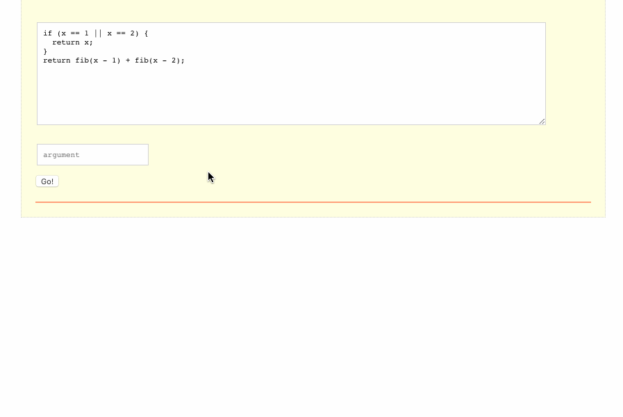

# Explore Your Call Stack 🥞

`CallStackExplorer` (CSE) is a tool which helps to understand how recursion works

## Features

- ✅arbitrary function body
- arbitrary arguments list (**there's only one argument supported so far**)
- cache hit
- SVG tree zoom in/out
- show a path for each node on hover

> This project was bootstrapped with [Create React App](https://github.com/facebook/create-react-app).
